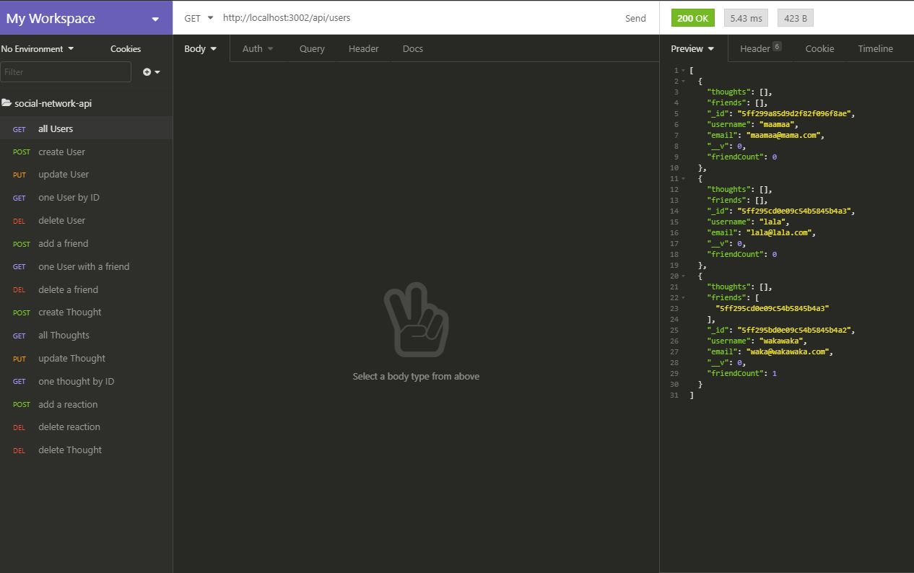

# Social Network API
## Table of Contents
- [Description](##Description)
- [Installation](##How-to-install)
- [Usage](##Usage-information)
- [Contributing](##how-to-contribute)
- [Tests](##How-to-test-the-application)
- [Licence](##Licencing-information)
- [GitHub](##GitHub-profile)
- [Contact](##Contact-me-via-email)
## Description
> This is an API for a social network web application where users can share their thoughts, react to friends’ thoughts, and create a friend list.
[See it in action here](https://alexandraws29.github.io/social-network-api-video/)

## How To Install The Application
> Simply open the application in Insomnia Core and play around.
## Usage Information
> Use the app Insomnia Core to go through the program, adding users, friends, thoughts, and reactions.
## How To Contribute
> If you would like to make contributions, then please contact me through GitHub
## How To Test The Application
> Using the app Insomnia Core you can use test the application using the commands as seen in the video linked in the description of the program.
## Licencing Information
> Public Domain
## GitHub Profile
> github.com/alexandraws29 
## Contact Me Via Email
> <alexandraws29@outlook.com>
    